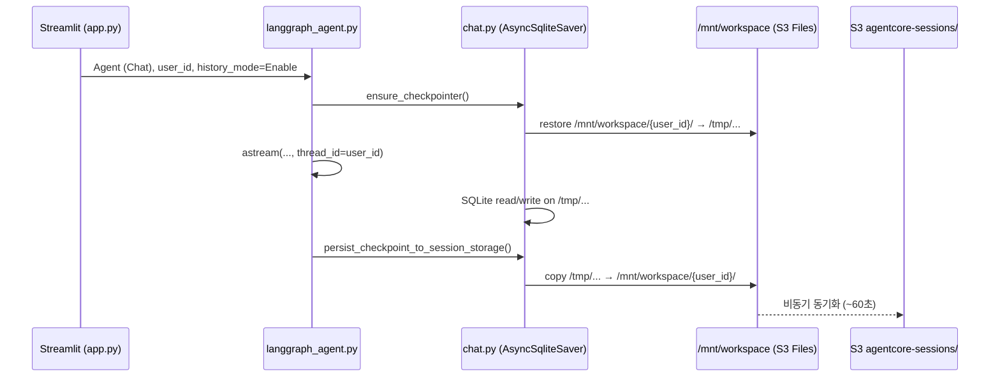
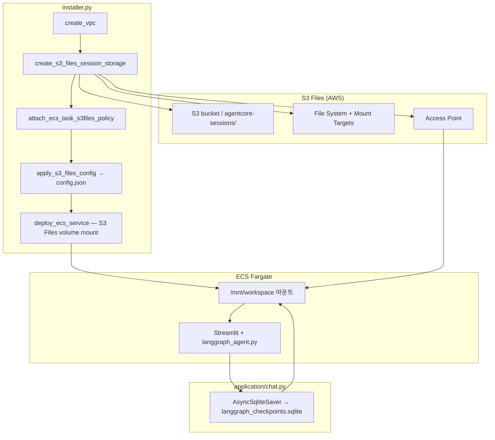
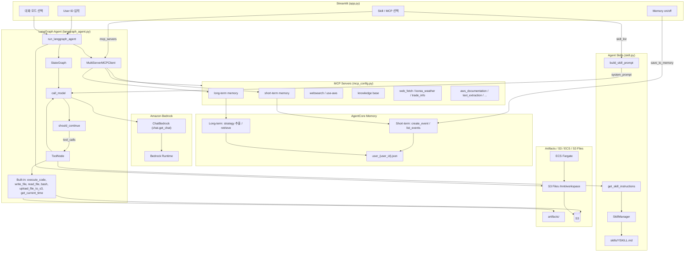

# ECS에서 LangGraph로 Agent 활용하기 

Agent는 MCP뿐 아니라 [Skill](https://github.com/anthropics/skills)을 활용하여 다양한 기능을 편리하게 구현할 수 있으며, [LangGraph](https://www.langchain.com/langgraph)로 구현한 Agent를 ECS Fargate에 배포하여 활용합니다. CloudFront → ALB → ECS Fargate로 Streamlit을 제공하고, User ID별로 대화·메모리를 분리합니다. **Agent (Chat)** 모드의 LangGraph checkpoint는 **Amazon S3 Files**를 `/mnt/workspace`에 마운트하여 ECS 태스크 재시작 후에도 유지합니다.

전체 인프라는 [installer.py](./installer.py)로 자동 배포합니다. Agent는 MCP와 skill을 함께 활용하여 RAG, 웹 검색, 문서 처리 등 다양한 작업을 수행할 수 있습니다.


## Session Storage (S3 Files)

**Agent (Chat)** 모드에서 LangGraph 대화 이력(checkpoint)을 유지하려면 **Session Storage**가 필요합니다. 이 프로젝트는 ECS Fargate 태스크 재시작·배포 후에도 checkpoint를 유지하기 위해 **Amazon S3 Files**를 `/mnt/workspace`에 마운트하고, LangGraph **AsyncSqliteSaver**가 `langgraph_checkpoints.sqlite`에 대화 이력을 저장합니다.

| 구분 | AgentCore Memory (위 Memory 절) | S3 Files Session Storage (본 절) |
|------|--------------------------------|----------------------------------|
| 목적 | short/long term memory (MCP·strategy) | LangGraph **Agent (Chat)** checkpoint |
| 저장 형식 | Bedrock Memory 이벤트·record | SQLite `langgraph_checkpoints.sqlite` |
| 활성 조건 | Memory 체크박스 `Enable` | **Agent (Chat)** + `history_mode=Enable` |
| 백엔드 | AgentCore Memory API | S3 bucket `agentcore-sessions/` prefix |

### ECS Task Definition 마운트

[langgraph-runtime](https://github.com/kyopark2014/langgraph-runtime)의 AgentCore Runtime은 `s3FilesAccessPoint` API로 마운트합니다. **본 프로젝트(ECS)** 는 [installer.py](./installer.py)의 `deploy_ecs_service()`에서 ECS Fargate task definition에 S3 Files 볼륨을 붙입니다.

```python
# installer.py — deploy_ecs_service() 요약
task_definition_kwargs["volumes"] = [
    {
        "name": "session-storage",
        "s3filesVolumeConfiguration": {
            "fileSystemArn": file_system_arn,
            "accessPointArn": access_point_arn,
            "rootDirectory": "/",
        },
    }
]
container_definition["mountPoints"] = [
    {
        "sourceVolume": "session-storage",
        "containerPath": "/mnt/workspace",
        "readOnly": False,
    }
]
container_definition["environment"] = [
    {"name": "SESSION_STORAGE_DIR", "value": "/mnt/workspace"},
    # ... APP_CONFIG_JSON 등
]
```

ECS 태스크는 private subnet에서 실행되며, S3 Files mount target SG와 NFS **TCP 2049**로 통신합니다.

### LangGraph checkpointer 연동

기존 `MemorySaver`는 프로세스 메모리에만 저장되어 컨테이너가 재시작되면 history가 사라집니다. **Agent (Chat)** 모드(`history_mode=Enable`)일 때 [application/chat.py](./application/chat.py)의 `ensure_checkpointer()`가 **AsyncSqliteSaver**를 초기화하고, [application/langgraph_agent.py](./application/langgraph_agent.py)의 `buildChatAgentWithHistory()`가 이를 checkpointer로 사용합니다.

| 경로 | 역할 |
|------|------|
| `/tmp/langgraph-checkpoints/{user_id}/langgraph_checkpoints.sqlite` | 런타임 working copy (NFS 잠금 회피) |
| `/mnt/workspace/{user_id}/langgraph_checkpoints.sqlite` | durable copy (S3 Files 마운트) |
| `s3://{bucket}/agentcore-sessions/{user_id}/...` | S3 동기화 대상 (NFS → S3 지연 ~60초) |

```python
# application/chat.py — 요약
async def ensure_checkpointer():
    _restore_from_session_storage(checkpoint_db)  # /mnt/workspace → /tmp 복원
    _sqlite_checkpointer = await _open_existing_sqlite_checkpointer(checkpoint_db)
    # 또는 신규 DB 생성

async def persist_checkpoint_to_session_storage():
    # WAL flush 후 working DB → /mnt/workspace/{user_id}/ 복사
```

요청 종료 시 [application/langgraph_agent.py](./application/langgraph_agent.py)의 `run_langgraph_agent()`가 `finally`에서 `persist_checkpoint_to_session_storage()`를 호출합니다.

```python
# application/langgraph_agent.py — run_langgraph_agent()
try:
    async for stream in app.astream(inputs, config, stream_mode="messages"):
        ...
finally:
    if history_mode == "Enable":
        await chat.persist_checkpoint_to_session_storage()
```

`buildChatAgentWithHistory()`는 compile 시 checkpointer를 전달합니다.

```python
return workflow.compile(
    checkpointer=chat.checkpointer,
    store=chat.memorystore,
)
```

### User ID와 thread_id

ECS Streamlit 앱은 AgentCore Runtime을 거치지 않으므로, 세션 키는 **User ID**를 사용합니다.

- `config["configurable"]["thread_id"]` = `chat.user_id`
- checkpoint 파일 경로 = `/mnt/workspace/{user_id}/langgraph_checkpoints.sqlite`
- 동일 User ID로 재접속하면 이전 checkpoint를 복원



### 환경 변수·config.json

| 변수 / 키 | 기본값 | 설명 |
|-----------|--------|------|
| `SESSION_STORAGE_DIR` (환경 변수) | `/mnt/workspace` | ECS task definition에서 설정 |
| `s3_files_mount_path` (config.json) | `/mnt/workspace` | installer가 기록 |
| `s3_files_access_point_arn` | — | S3 Files access point ARN |
| `s3_files_file_system_id` | — | S3 Files file system ID |

로컬 개발 시 `/mnt/workspace`가 없으면 `application/.session_storage/{user_id}/`를 사용합니다.

### S3 Files 활용

LangGraph checkpoint를 ECS 배포·태스크 재시작 후에도 유지하려면 **Amazon S3 Files**를 bring-your-own 파일시스템으로 마운트합니다. [langgraph-runtime/README.md](https://github.com/kyopark2014/langgraph-runtime/blob/main/README.md)의 S3 Files 설계를 ECS Fargate에 맞게 적용한 것입니다.

| 항목 | ECS (본 프로젝트) | langgraph-runtime (참고) |
|------|-------------------|--------------------------|
| 마운트 방식 | ECS `s3filesVolumeConfiguration` | AgentCore `s3FilesAccessPoint` API |
| 네트워크 | Fargate private subnet + NFS 2049 | AgentCore Runtime VPC 모드 |
| 태스크 재시작 후 | checkpoint **유지** | cold start 후 **유지** |
| 실제 저장소 | S3 `agentcore-sessions/` prefix | 동일 |
| 앱 코드 | `SESSION_STORAGE_DIR=/mnt/workspace` | 동일 패턴 |

#### 전체 아키텍처



#### 배포 흐름 (`installer.py`)

VPC 생성 직후 `[5.5/10] Creating S3 Files session storage for ECS` 단계에서 다음을 **멱등**으로 프로비저닝합니다.

1. **`_get_or_create_s3files_sync_role()`** — S3 ↔ NFS 동기화용 IAM role (`elasticfilesystem.amazonaws.com` trust)
2. **`_get_or_create_s3files_file_system()`** — `agentcore-sessions/` prefix, bucket versioning `Enabled` 필수
3. **Security groups** — ECS SG ↔ mount target SG, NFS **TCP 2049**
4. **`_ensure_s3files_mount_targets()`** — private subnet별 mount target
5. **`_get_or_create_s3files_access_point()`** — POSIX `uid/gid: 0/0`
6. **`_ensure_s3files_file_system_policy()`** — ECS task role에 NFS `ClientMount` / `ClientWrite` 허용
7. **`attach_ecs_task_s3files_policy()`** — ECS task role IAM에 `s3files:GetAccessPoint`, `ListMountTargets` 등 추가
8. **`deploy_ecs_service()`** — task definition에 `s3filesVolumeConfiguration` + `mountPoints`

`application/config.json`에 저장되는 키:

```json
{
  "s3_files_file_system_id": "fs-xxxxxxxx",
  "s3_files_access_point_arn": "arn:aws:s3files:...",
  "s3_files_mount_path": "/mnt/workspace",
  "ecs_session_vpc_subnets": ["subnet-aaa", "subnet-bbb"],
  "ecs_session_security_groups": ["sg-ecs-xxx"]
}
```

#### ECS task role IAM (요약)

`attach_ecs_task_s3files_policy()`가 task role에 아래 권한을 추가합니다.

```python
file_system_arn = f"arn:aws:s3files:{region}:{accountId}:file-system/{file_system_id}"

# Client mount/write (file system ARN + access point condition)
{
    "Sid": "S3FilesClientAccess",
    "Effect": "Allow",
    "Action": ["s3files:ClientMount", "s3files:ClientWrite", "s3files:ClientRootAccess"],
    "Resource": file_system_arn,
    "Condition": {
        "ArnEquals": {"s3files:AccessPointArn": "{access_point_arn}"}
    },
}
# GetAccessPoint (access point ARN)
{
    "Sid": "S3FilesGetAccessPoint",
    "Effect": "Allow",
    "Action": ["s3files:GetAccessPoint"],
    "Resource": "{access_point_arn}",
}
```

**S3 Files file system policy** — `_ensure_s3files_file_system_policy()`가 ECS task role을 Principal로 resource-based policy를 설정합니다.

배포 로그에서 아래 메시지로 S3 Files 적용 여부를 확인할 수 있습니다.

```text
[5.5/10] Creating S3 Files session storage for ECS
✓ S3 Files session storage ready for ECS
  S3 Files volume mounted at /mnt/workspace (access point: arn:aws:s3files:...)
  ECS Session Mount Path: /mnt/workspace
```

애플리케이션 로그에서 checkpoint 복원 여부:

```text
SQLite checkpointer opened (existing): /tmp/langgraph-checkpoints/{user_id}/langgraph_checkpoints.sqlite
Checkpoint persisted to session storage: /mnt/workspace/{user_id}/langgraph_checkpoints.sqlite
```

`opened (existing)`이면 이전 history 복원 성공, `initialized`이면 새 DB 생성(이전 history 없음)입니다.

#### 적용·재배포

```bash
cd langgraph-ecs-project
pip install -r requirements.txt   # langgraph-checkpoint-sqlite, aiosqlite 포함
python3 installer.py              # S3 Files + ECS task definition 재등록
```

Docker 이미지를 갱신한 경우 installer가 ECR push 후 ECS service를 `forceNewDeployment`합니다.

#### 주의사항

- S3 bucket **versioning은 `Enabled`** 여야 합니다 (`create_s3_bucket()` / `_ensure_s3_bucket_versioning_enabled`).
- S3 Files는 **private subnet + NFS 2049**가 필요합니다. SG·AZ가 맞지 않으면 태스크가 checkpoint에 쓰지 못할 수 있습니다.
- S3 Files는 NFS 기반이므로 S3 API로 즉시 읽어야 하는 downstream에는 동기화 지연(~60초)을 고려해야 합니다.
- access point POSIX UID/GID는 컨테이너 실행 사용자와 일치해야 합니다. 현재 구현은 `uid/gid: 0/0`(root)입니다.
- checkpoint 파일은 버킷 루트가 아니라 **`agentcore-sessions/`** prefix 아래에 동기화됩니다. 콘솔에서 prefix로 확인하세요.
- **의존성**: [Dockerfile](./Dockerfile), [requirements.txt](./requirements.txt)에 `langgraph-checkpoint-sqlite`, `aiosqlite`가 포함되어 있습니다.
- **트러블슈팅**
  - S3 bucket에 `agentcore-sessions/`가 없음 → 첫 대화 후 1~2분 대기, `history_mode=Enable` 및 `persist_checkpoint_to_session_storage` 로그 확인
  - `/mnt/workspace`에 `Permission denied` → `_ensure_s3files_file_system_policy()` 및 `attach_ecs_task_s3files_policy()` 재실행(installer 재배포)
  - 대화 초기화 후에도 파일이 남음 → S3 Files는 파일 삭제까지 동기화 지연 가능; 로컬은 `chat.reset_checkpoint_state()` + `대화 초기화` 버튼 사용
  - CloudWatch `/ecs/app-for-{project}` 로그에서 `SQLite checkpointer` 메시지 확인


## Operation Architecture



| 모드 | 모듈 | 설명 |
|------|------|------|
| 일상적인 대화 | `chat.general_conversation` | 대화 이력 + ChatBedrock 스트리밍 |
| RAG | `chat.run_rag_with_knowledge_base` | Bedrock Knowledge Base 검색(`retrieve`) 후 ChatBedrock으로 답변 생성 |
| **Agent** | `langgraph_agent.run_langgraph_agent` | LangGraph StateGraph + built-in tools + MCP + Skills (단일 턴) |
| **Agent (Chat)** | `langgraph_agent.run_langgraph_agent` | Agent와 동일 + **AsyncSqliteSaver** checkpointer로 대화 이력 유지 (`thread_id` = `user_id`, S3 Files `/mnt/workspace`) |
| 번역하기 | `chat.translate_text` | 한국어 ↔ 영어 번역 |
| 이미지 분석 | `chat.summarize_image` | ChatBedrock 멀티모달 (이미지 + 텍스트) 분석 |

### Message Trim

LangGraph 에이전트([application/langgraph_agent.py](./application/langgraph_agent.py)의 `call_model`)는 LLM 호출 직전에 **HumanMessage 기준 최근 N턴**만 남깁니다. LangGraph state의 `messages`는 checkpointer에 그대로 두고, **모델에 넘기는 메시지만** trim합니다. `history_mode=Enable`/`Disable` 모두 동일하게 적용됩니다.

**기본값:** `MAX_CONTEXT_TURNS = 5` (일반 채팅의 `SimpleMemory(k=5)`와 동일한 “최근 5턴” 의도)

**설정 변경:**

- [application/langgraph_agent.py](./application/langgraph_agent.py)의 `MAX_CONTEXT_TURNS` 상수 수정
- 또는 `create_agent()`에서 생성하는 config의 `max_turns` / `configurable.max_turns` 지정
- `max_turns=0`이면 trim 비활성화

상수와 trim 함수는 `langgraph_agent.py`에 정의합니다.

```python
# application/langgraph_agent.py
MAX_CONTEXT_TURNS = 5


def trim_messages_by_human_turns(messages: list, max_turns: int) -> list:
    """Keep messages from the last N HumanMessage turns (inclusive)."""
    if max_turns <= 0 or not messages:
        return messages

    human_indices = [i for i, msg in enumerate(messages) if isinstance(msg, HumanMessage)]
    if len(human_indices) <= max_turns:
        return messages

    return messages[human_indices[-max_turns]:]
```

`call_model`에서는 `ToolMessage` content 정규화 후 trim을 적용합니다.

```python
# application/langgraph_agent.py — call_model() 내부
        max_turns = (
            config.get("configurable", {}).get("max_turns")
            or config.get("max_turns")
            or MAX_CONTEXT_TURNS
        )
        trimmed = trim_messages_by_human_turns(messages, max_turns)
        if len(trimmed) < len(messages):
            logger.info(
                f"trimmed messages from {len(messages)} to {len(trimmed)} "
                f"(max_turns={max_turns})"
            )
            messages = trimmed

        prompt = ChatPromptTemplate.from_messages([
            ("system", system),
            MessagesPlaceholder(variable_name="messages"),
        ])
        chain = prompt | model
        async for chunk in chain.astream({"messages": messages}):
            ...
```

에이전트 config는 `create_agent()`에서 생성하며, `history_mode`와 관계없이 `max_turns`를 전달합니다.

```python
# application/langgraph_agent.py — create_agent()
    if history_mode == "Enable":
        await chat.ensure_checkpointer()
        app = buildChatAgentWithHistory(tools)
        config = {
            "recursion_limit": 500,
            "configurable": {"thread_id": chat.user_id},
            "tools": tools,
            "system_prompt": system_prompt,
            "max_turns": MAX_CONTEXT_TURNS,
        }
    else:
        app = buildChatAgent(tools)
        config = {
            "recursion_limit": 500,
            "configurable": {"thread_id": chat.user_id},
            "tools": tools,
            "system_prompt": system_prompt,
            "max_turns": MAX_CONTEXT_TURNS,
        }
```

**`max_turns=5`의 의미**

- **사용자 HumanMessage 5개**와, 각 턴에 이어진 **모든 후속 메시지**를 유지
- 1턴 = `HumanMessage` 1개 + 그 뒤의 `AIMessage`, `ToolMessage`, 도구 feedback loop 전체
- 도구를 여러 번 호출해도 **같은 사용자 질문이면 1턴**으로 카운트

**예 (도구 사용 포함)**

```
Human(Q1) → AI(tool_calls) → ToolMessage → AI(A1)
Human(Q2) → AI(A2)
Human(Q3) → AI(tool_calls) → ToolMessage → AI(A3)
```

`max_turns=2`이면 **Q2부터** 유지:

```
Human(Q2) → AI(A2) → Human(Q3) → AI(tool_calls) → ToolMessage → AI(A3)
```

**메시지 개수 trim과의 차이**

| 방식 | `N=5`일 때 |
|------|------------|
| 이전 (메시지 개수) | 메시지 객체 5개만 유지 → 도구 루프 때문에 사용자 턴 수가 불규칙 |
| 현재 (HumanMessage 턴) | 사용자 질문 5개 + 각 턴의 AI/Tool 응답 전체 유지 |

**Checkpointer와의 관계**

- `history_mode=Enable`일 때 **AsyncSqliteSaver** checkpointer에 **전체 대화 이력**이 저장됩니다. ([Session Storage (S3 Files)](#session-storage-s3-files) 참조)
- trim은 LLM 컨텍스트 윈도우 관리용이며, 저장된 history를 삭제하지 않습니다.
- 요청 종료 시 `persist_checkpoint_to_session_storage()`가 working DB를 `/mnt/workspace/{user_id}/`로 복사합니다.
- CloudWatch(`/ecs/...`) 또는 애플리케이션 로그에서 `trimmed messages from X to Y (max_turns=5)`, `SQLite checkpointer opened (existing)` 메시지를 확인할 수 있습니다.

## 배포하기

### installer.py로 배포하기

저장소를 클론한 후 `installer.py`로 전체 인프라(AgentCore Memory, Knowledge Base, VPC, **S3 Files 세션 스토리지**, ALB, ECS Fargate, CloudFront)를 배포합니다.

```bash
git clone https://github.com/kyopark2014/langgraph-ecs-project
cd langgraph-ecs-project
pip install -r requirements.txt
python installer.py
```

API 구현에 필요한 credential은 secret으로 관리합니다. 설치 시 필요한 credential 예시:

- 일반 인터넷 검색: [Tavily Search](https://app.tavily.com/sign-in) API Key (`tvly-`로 시작)
- 날씨 검색: [openweathermap](https://home.openweathermap.org/api_keys) API Key (Free plan)

설치가 완료되면 CloudFront URL로 접속하여 Agent를 실행합니다. 앱 시작 시 **User ID**를 입력하고, 사이드바에서 **Memory** 및 MCP(`short term memory`, `long term memory`)를 선택합니다. **Agent (Chat)** 모드에서 User ID별 LangGraph checkpoint가 S3 Files(`/mnt/workspace`)에 영속화됩니다.

인프라가 더 이상 필요 없을 때에는 [uninstaller.py](./uninstaller.py)를 이용해 제거합니다.

```bash
python uninstaller.py
```

상세한 installer 동작은 [installer.md](./installer.md)를 참조하세요.


### Local에서 실행하기

AWS 환경을 잘 활용하기 위해서는 [AWS CLI를 설치](https://docs.aws.amazon.com/ko_kr/cli/v1/userguide/cli-chap-install.html)하여야 합니다. Local에 설치시는 아래 명령어를 참조합니다.

```text
curl "https://awscli.amazonaws.com/awscli-exe-linux-x86_64.zip" -o "awscliv2.zip"
unzip awscliv2.zip
sudo ./aws/install
```

AWS credential을 아래와 같이 AWS CLI를 이용해 등록합니다.

```text
aws configure
```

venv로 환경을 구성하면 편리하게 패키지를 관리합니다.

```text
python -m venv .venv
source .venv/bin/activate
```

이후 다운로드 받은 github 폴더로 이동한 후에 아래와 같이 필요한 패키지를 추가로 설치 합니다.

```text
pip install -r requirements.txt
```

installer로 AgentCore Memory와 Knowledge Base를 먼저 프로비저닝한 뒤, 아래와 같이 streamlit을 실행합니다.

```text
streamlit run application/app.py
```

앱 시작 시 User ID를 입력하고, Agent (Chat) 모드에서 Memory를 켠 상태로 대화하면 AgentCore Memory에 저장됩니다.


### MCP

Plugin의 Connector는 MCP를 이용해 구현합니다. Memory 관련 MCP는 아래와 같습니다.

- **short term memory**: [mcp_server_short_term_memory.py](./application/mcp_server_short_term_memory.py) — 최근 대화 이벤트 조회 (`list_events`)
- **long term memory**: [mcp_server_long_term_memory.py](./application/mcp_server_long_term_memory.py) — 시맨틱 검색·CRUD (`long_term_memory`)

기타 MCP 설정은 아래를 참조합니다.

- [Slack](https://github.com/kyopark2014/mcp/blob/main/mcp-slack.md): Slack 내용을 조회하고 메시지를 보낼 수 있습니다. SLACK_TEAM_ID, SLACK_BOT_TOKEN으로 설정합니다.

- [Tavily](https://github.com/kyopark2014/mcp/blob/main/mcp-tavily.md): Tavily를 이용해 인터넷을 검색합니다. [installer.py](./installer.py)에서 secret으로 설정후에 [utils.py](./application/utils.py)에서 TAVILY_API_KEY로 등록하여 활용합니다.

- [RAG](https://github.com/kyopark2014/mcp/blob/main/mcp-rag.md): Knowledge Base를 이용해 RAG를 활용합니다. IAM 인증을 이용하므로 별도로 credential 설정하지 않습니다.

- [web_fetch](https://github.com/kyopark2014/mcp/blob/main/mcp-web-fetch.md): playwright기반으로 url의 문서를 markdown으로 불러올 수 있습니다. 별도 인증이 필요하지 않습니다.

- [Google 메일/캘린더](https://github.com/kyopark2014/mcp/blob/main/mcp-gog.md): 구글 메일을 조회하거나 보낼 수 있습니다. Gog CLI를 설치하여 google 인증을 통해 활용합니다.

- [Notion](https://github.com/kyopark2014/mcp/blob/main/mcp-notion.md): Notion을 읽거나 쓸 수 있습니다. [installer.py](./installer.py)에서 secret으로 설정후에 [utils.py](./application/utils.py)에서 NOTION_TOKEN을 등록하여 활용합니다.

- [text_extraction](https://github.com/kyopark2014/mcp/blob/main/mcp-text-extraction.md): 이미지의 텍스트를 추출합니다. 별도 인증이 필요하지 않습니다.


## 실행 결과


## Reference

[langgraph-runtime — Session Storage / S3 Files (참고)](https://github.com/kyopark2014/langgraph-runtime#session-storage)

[Amazon Bedrock AgentCore Memory](https://docs.aws.amazon.com/bedrock-agentcore/latest/devguide/memory-getting-started.html)

[agentcore-memory (참조 프로젝트)](https://github.com/kyopark2014/agent-memory)

[anthropics / skills](https://github.com/anthropics/skills)

[Agent Skills](https://agentskills.io/home)

[Notion Skills for Claude](https://www.notion.so/notiondevs/Notion-Skills-for-Claude-28da4445d27180c7af1df7d8615723d0)

[Claude Code Skills](https://support.claude.com/en/articles/12512176-what-are-skills)

[example skills](https://github.com/anthropics/skills)

[Agent Skills for Strands Agents SDK](https://github.com/aws-samples/sample-strands-agents-agentskills)

[Claude Code Plugins: Orchestration and Automation](https://github.com/wshobson/agents/tree/main)

[Deep Agents CLI](https://github.com/langchain-ai/deepagents/tree/master/libs/cli)

[Using skills with Deep Agents CLI](https://www.youtube.com/watch?v=Yl_mdp2IiW4)

[Open Agent Skills](https://skills.sh/)
