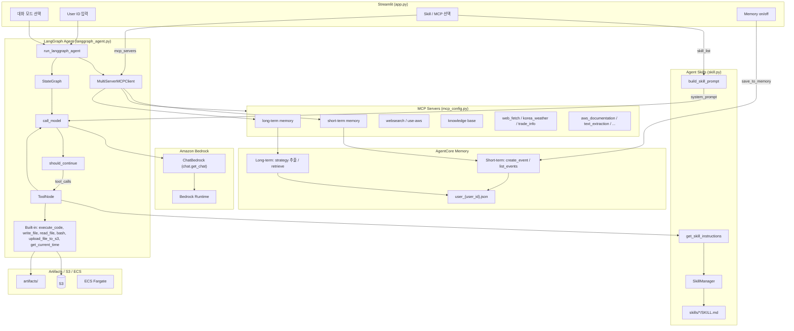

# ECS에서 Agent 활용하기 — AgentCore Memory

[Amazon Bedrock AgentCore Memory](https://docs.aws.amazon.com/bedrock-agentcore/latest/devguide/memory-getting-started.html)를 활용하여 LangGraph Agent에서 단기/장기 메모리를 구현합니다. Agent는 MCP뿐 아니라 [Skill](https://github.com/anthropics/skills)을 활용하여 다양한 기능을 편리하게 구현할 수 있으며, [LangGraph](https://www.langchain.com/langgraph)로 구현한 Agent를 ECS Fargate에 배포하여 활용합니다. CloudFront → ALB → ECS Fargate로 Streamlit을 제공하고, User ID별로 대화·메모리를 분리합니다.

전체 인프라는 [installer.py](./installer.py)로 자동 배포합니다. Agent는 MCP와 skill을 함께 활용하여 RAG, 웹 검색, 문서 처리 등 다양한 작업을 수행할 수 있습니다.


## Memory

Chatbot은 연속적인 사용자의 대화를 이용하여 사용자의 경험을 향상시킬 수 있습니다. 일반 대화형 chatbot에서는 이전 대화를 [sliding window](https://langchain-ai.github.io/langgraph/concepts/memory/) 형태로 context에 포함하므로 사용할 수 있는 대화의 숫자가 제한되고, 이전 대화가 필요하지 않는 경우에도 context를 사용하는 문제가 있습니다. 여기에서는 short/long term memory를 지원하는 MCP와 AgentCore Memory를 이용하여 생성형 AI 애플리케이션이 필요할 때마다 메모리를 조회·저장하는 방법을 설명합니다.

[AgentCore Memory](https://docs.aws.amazon.com/bedrock-agentcore/latest/devguide/memory-getting-started.html)를 이용하면 별도의 DB를 만들어서 관리하지 않아도 short/long term memory를 손쉽게 활용할 수 있습니다. 대화 중 발생하는 transaction은 short-term memory에 저장되며, 주로 최근 n개의 메시지를 가져오는 방식으로 활용됩니다. 대화 중 중요한 정보는 long-term memory에 namespace를 이용해 저장됩니다. Long-term memory는 prompt를 가진 strategy를 이용해 사용자의 메시지로부터 필요한 정보를 자동으로 추출합니다.

### Short Term Memory

Short term memory를 위해서는 대화 transaction을 아래와 같이 AgentCore Memory에 저장합니다. 상세한 코드는 [agentcore_memory.py](./application/agentcore_memory.py)을 참조합니다.

```python
def save_conversation_to_memory(memory_id, actor_id, session_id, query, result):
    event_timestamp = datetime.now(timezone.utc)
    conversation = [
        (query, "USER"),
        (result, "ASSISTANT")
    ]
    memory_result = memory_client.create_event(
        memory_id=memory_id,
        actor_id=actor_id,
        session_id=session_id,
        event_timestamp=event_timestamp,
        messages=conversation
    )
```

이후, 대화 중에 사용자의 이전 대화 정보가 필요하다면 [mcp_server_short_term_memory.py](./application/mcp_server_short_term_memory.py)와 같이 memory, actor, session로 `max_results` 만큼의 이전 대화를 조회하여 활용합니다.

```python
events = client.list_events(
    memory_id=memory_id,
    actor_id=actor_id,
    session_id=session_id,
    max_results=max_results
)
```

### Long Term Memory

Long term memory를 위해 필요한 정보에는 memory, actor, session, namespace가 있습니다. 아래와 같이 이미 저장된 값이 있다면 가져오고, 없다면 생성합니다. 상세한 코드는 [chat.py](./application/chat.py)의 `initiate_memory()`를 참조합니다.

```python
# initiate memory variables
memory_id, actor_id, session_id, namespace = agentcore_memory.load_memory_variables(chat.user_id)
logger.info(f"memory_id: {memory_id}, actor_id: {actor_id}, session_id: {session_id}, namespace: {namespace}")

if memory_id is None:
    memory_id = agentcore_memory.retrieve_memory_id()
    if memory_id is None:
        memory_id = agentcore_memory.create_memory(namespace, chat.user_id)

    agentcore_memory.create_strategy_if_not_exists(
        memory_id=memory_id, namespace=namespace, strategy_name=chat.user_id
    )
    agentcore_memory.update_memory_variables(
        user_id=chat.user_id,
        memory_id=memory_id,
        actor_id=actor_id,
        session_id=session_id,
        namespace=namespace,
    )
```

생성형 AI 애플리케이션에서는 대화 중 필요한 메모리 정보가 있다면 MCP를 이용해 조회합니다. [mcp_server_long_term_memory.py](./application/mcp_server_long_term_memory.py)에서는 long term memory를 이용해 대화 이벤트를 저장하거나 조회할 수 있습니다.

```python
response = retrieve_memory_records(
    memory_id=memory_id,
    namespace=namespace,
    search_query=query,
    max_results=max_results,
    next_token=next_token,
)
```

"내가 다니는 회사에 대해 소개해줘"라고 질문하면 long term memory에서 사용자에 대한 정보를 가져와 답변할 수 있습니다.


## 사전 설치 (Prerequisites)

```bash
pip install bedrock-agentcore
python installer.py --project-name langgraph-ecs-project --region us-west-2
```

`installer.py`가 수행하는 작업 (Memory 관련):

1. AgentCore Memory용 IAM Role 생성 (`role-agentcore-memory-for-{project_name}-{region}`)
2. AgentCore Memory 인스턴스 생성 (기존 memory가 있으면 재사용)
3. `application/config.json`에 `agentcore_memory_role`, `memory_id` 저장
4. VPC, ALB, ECS Fargate, Knowledge Base, AgentCore Web Search Gateway 등 인프라 배포

## Memory 초기화 흐름

앱 실행 시 [app.py](./application/app.py)에서 User ID를 입력받고, `chat.set_user_id()`로 `mcp.env`에 저장합니다. Agent 모드에서 **Memory** 체크박스가 켜져 있으면 응답 후 `save_to_memory()`가 호출됩니다.

```
앱 시작
  └─ User ID 입력 (st.session_state.user_id)
       └─ chat.set_user_id() → mcp.env {"user_id": "..."} 저장

Agent (Chat) 응답 완료 + Memory Enable
  └─ save_to_memory(prompt, response)
       └─ memory_id가 None이면 → initiate_memory()
            ├─ agentcore_memory.load_memory_variables(user_id)
            │    ├─ user_{user_id}.json 에서 기존 변수 로드
            │    ├─ config.json의 memory_id 또는 retrieve_memory_id()로 조회
            │    └─ 여전히 없으면 → create_memory()로 신규 생성
            ├─ create_strategy_if_not_exists()로 strategy 확인/생성
            └─ update_memory_variables()로 user_{user_id}.json에 저장
       └─ agentcore_memory.save_conversation_to_memory()
```

## 주요 변수

### config.json (프로젝트 설정)

| 변수 | 설명 |
|------|------|
| `projectName` | 프로젝트 이름. memory name으로도 사용 (`-` → `_` 치환) |
| `region` | AWS 리전 |
| `accountId` | AWS 계정 ID |
| `agentcore_memory_role` | Memory 실행용 IAM Role ARN |
| `memory_id` | installer가 생성한 AgentCore Memory 인스턴스 ID |

### user_{user_id}.json (사용자별 설정)

| 변수 | 설명 |
|------|------|
| `memory_id` | AgentCore Memory 인스턴스 ID |
| `actor_id` | 사용자 식별자 (기본값: `user_id`) |
| `session_id` | 세션 ID (기본값: `uuid4().hex`로 자동 생성) |
| `namespace` | memory namespace (기본값: `/users/{actor_id}`) |

### mcp.env (MCP 서버용)

| 변수 | 설명 |
|------|------|
| `user_id` | short/long term memory MCP가 사용자를 식별하는 ID |

```json
{"user_id": "user01"}
```

### app.py / chat.py 변수

| 변수 | 설명 |
|------|------|
| `user_id` | Streamlit에서 입력받은 사용자 ID (`chat.user_id`) |
| `enable_memory` | Memory 체크박스 상태 (`Enable` / `Disable`) |
| `memoryMode` | app.py 사이드바 Memory on/off |

## 대화 저장 방법

[app.py](./application/app.py)에서 Agent / Agent (Chat) 모드 응답 후 Memory가 켜져 있으면 `save_to_memory()`를 호출합니다.

```python
if memoryMode == "Enable":
    chat.save_to_memory(prompt, response)
```

`save_to_memory()`는 내부적으로 아래를 호출합니다.

```python
agentcore_memory.save_conversation_to_memory(memory_id, actor_id, session_id, query, result)
```

저장 과정:

1. `query`(사용자 입력)와 `result`(어시스턴트 응답)의 유효성 검사
2. AWS Bedrock 제한에 맞게 9,000자 초과 시 truncate
3. `(query, "USER")`, `(result, "ASSISTANT")` 형태의 conversation으로 변환
4. `memory_client.create_event()`로 memory에 이벤트 저장

### Memory Strategy

memory 생성 시 `customMemoryStrategy`가 함께 설정됩니다:

- **모델**: `us.anthropic.claude-haiku-4-5-20251001-v1:0`
- **역할**: 대화에서 사용자의 명시적/암시적 선호도를 추출 (한국어)
- **만료**: 이벤트 365일 후 만료


## MCP를 이용한 메모리 활용

MCP(Model Context Protocol) 서버를 통해 에이전트가 단기/장기 메모리에 접근할 수 있습니다. [mcp_config.py](./application/mcp_config.py)에서 `short term memory`, `long term memory`를 선택하면 stdio MCP 서버가 연결됩니다.

### 단기 메모리 (Short-Term Memory)

**파일**: [mcp_server_short_term_memory.py](./application/mcp_server_short_term_memory.py)

| 도구 | 파라미터 | 설명 |
|------|---------|------|
| `list_events` | `max_results` (기본값: 10) | 현재 세션의 최근 대화 이벤트 목록 조회 |

**동작 방식**:

1. `mcp.env`에서 `user_id`를 읽어옴
2. `agentcore_memory.load_memory_variables()`로 `memory_id`, `actor_id`, `session_id` 로드
3. `MemoryClient.list_events()`로 최근 대화 이벤트 반환

### 장기 메모리 (Long-Term Memory)

**파일**: [mcp_server_long_term_memory.py](./application/mcp_server_long_term_memory.py) → [mcp_long_term_memory.py](./application/mcp_long_term_memory.py)

| 도구 | 설명 |
|------|------|
| `long_term_memory` | 장기 메모리에 대한 CRUD 및 시맨틱 검색 |

**`long_term_memory` action**:

| action | 설명 | API |
|--------|------|-----|
| `record` | 텍스트를 memory에 이벤트로 저장 | `create_event()` |
| `retrieve` | 시맨틱 검색으로 관련 memory record 조회 | `retrieve_memory_records()` |
| `list` | 전체 memory record 목록 조회 | `list_memory_records()` |
| `get` | 특정 memory record를 ID로 조회 | `get_memory_record()` |
| `delete` | 특정 memory record 삭제 | `delete_memory_record()` |

### 단기 vs 장기 메모리 비교

| 구분 | 단기 메모리 | 장기 메모리 |
|------|-----------|-----------|
| 데이터 | 원본 대화 이벤트 (USER/ASSISTANT) | strategy가 추출한 구조화된 기억 |
| 범위 | 현재 세션의 최근 대화 | 세션/시간에 걸친 축적된 지식 |
| 검색 | 시간순 목록 조회 | 시맨틱 검색 지원 |
| 용도 | 최근 맥락 참조 | 사용자 선호도, 패턴 등 장기 기억 활용 |


## Operation Architecture



| 모드 | 모듈 | 설명 |
|------|------|------|
| 일상적인 대화 | `chat.general_conversation` | 대화 이력 + ChatBedrock 스트리밍 |
| RAG | `chat.run_rag_with_knowledge_base` | Bedrock Knowledge Base 검색(`retrieve`) 후 ChatBedrock으로 답변 생성 |
| **Agent** | `langgraph_agent.run_langgraph_agent` | LangGraph StateGraph + built-in tools + MCP + Skills (단일 턴) |
| **Agent (Chat)** | `langgraph_agent.run_langgraph_agent` | Agent와 동일 + LangGraph checkpointer로 대화 이력 유지 (`thread_id` = `user_id`) |
| 번역하기 | `chat.translate_text` | 한국어 ↔ 영어 번역 |
| 이미지 분석 | `chat.summarize_image` | ChatBedrock 멀티모달 (이미지 + 텍스트) 분석 |


## Agent Skills

[Agent Skills](https://agentskills.io/specification)은 AI agent에게 특정 작업 수행 방법을 가르치는 재사용 가능한 지침 패키지입니다. Agent skills는 효과적으로 context를 관리하기 위하여 discovery, activation, execution의 과정을 거칩니다. 정리하면 agent가 관련된 skill의 name과 description을 읽는 discovery를 수행한 후에, SKILL.md에 포함된 instruction을 읽는 activation을 수행합니다. Agent는 instruction을 수행하는데 필요하다면 관련된 파일(referenced file)을 읽거나 포함된 코드(bundled code)를 실행합니다. 각 스킬은 `SKILL.md` 파일로 구성되며, YAML 프론트매터(name, description)와 상세 지침(워크플로, 코드 패턴 등)으로 이루어져 있습니다.

### Progressive Disclosure

시스템 프롬프트에는 스킬의 **이름과 설명만** XML 형태로 포함하고, 상세 지침은 agent가 `get_skill_instructions` 도구를 호출하여 **필요할 때만** 로드합니다. 이를 통해 프롬프트 크기를 최소화하면서도 agent가 다양한 스킬을 활용할 수 있습니다.

```xml
<available_skills>
  <skill>
    <name>pdf</name>
    <description>PDF 파일 읽기/병합/분할/OCR/폼 처리 등</description>
  </skill>
  ...
</available_skills>
```

### 스킬의 구조

각 스킬은 `SKILL.md` 파일 하나가 핵심이며, 필요에 따라 `scripts/`, `references/`, `assets/` 등의 보조 폴더를 포함할 수 있습니다.

```text
skills/
├── pdf/
│   ├── SKILL.md          # YAML 프론트매터 + 상세 지침
│   └── assets/           # 폰트 등 보조 리소스
├── notion/
│   └── SKILL.md
└── xlsx/
    └── SKILL.md
```

`SKILL.md`는 아래와 같이 YAML 프론트매터와 마크다운 본문으로 구성됩니다.

```markdown
---
name: pdf
description: PDF 파일 처리를 위한 스킬
---

# PDF Processing Guide

## Overview
이 가이드는 Python 라이브러리를 사용한 PDF 처리 작업을 다룹니다.
execute_code 도구로 아래의 Python 코드를 실행하세요.
...
```

### 스킬의 종류

스킬은 **베이스 스킬**과 **플러그인 스킬** 두 가지로 구분됩니다.

- **베이스 스킬** (`application/skills/`): Agent 모드에서 공통으로 사용하는 스킬입니다. 플러그인 모드에서도 기본으로 병합되어 함께 제공됩니다.

| 스킬 | 설명 |
|------|------|
| pdf | PDF 읽기/병합/분할/OCR/폼 처리 |
| notion | Notion API를 통한 페이지/DB/블록 관리 |
| memory-manager | MEMORY.md 기반 대화 메모리 관리 |
| docx | Word 문서 생성/편집/분석 |
| xlsx | 스프레드시트 작업/모델링 |
| pptx | PowerPoint 읽기/편집/생성 |
| myslide | AWS 테마 프레젠테이션 생성 |
| retrieve | Bedrock Knowledge Base RAG 검색 |
| skill-creator | 새로운 스킬 설계/패키징 가이드 |

- **플러그인 스킬** (`application/plugins/<플러그인명>/skills/`): 특정 플러그인 모드에서만 활성화되는 스킬입니다.

| 플러그인 | 스킬 | 설명 |
|----------|------|------|
| productivity | memory-management | 약어/별칭 해석 포함 메모리 관리 |
| productivity | task-management | TASKS.md 기반 작업 관리 |
| frontend-design | frontend-design | 프론트엔드 UI 구현 가이드 |
| enterprise-search | search-strategy | 질의 분해/다중 소스 검색 전략 |
| enterprise-search | knowledge-synthesis | 다중 소스 결과 통합/출처 부여 |
| enterprise-search | source-management | MCP 검색 소스 연결/우선순위 |

### 스킬의 동작 흐름

[skill.py](./application/skill.py)에서 구현된 스킬의 동작 흐름은 다음과 같습니다.

1. **스킬 탐색**: `SkillManager`가 스킬 디렉토리를 스캔하여 `SKILL.md`의 YAML 프론트매터(이름, 설명)를 레지스트리에 등록합니다.
2. **프롬프트 구성**: `build_skill_prompt()`가 활성화된 스킬의 이름/설명을 `<available_skills>` XML로 시스템 프롬프트에 포함합니다.
3. **지침 로드**: 사용자 요청에 맞는 스킬이 있으면 agent가 `get_skill_instructions` 도구를 호출하여 상세 지침을 로드합니다.
4. **작업 수행**: 로드된 지침에 따라 `execute_code`, `write_file` 등의 도구를 사용하여 작업을 수행합니다.
5. **결과 전달**: 결과 파일이 있으면 `upload_file_to_s3`로 업로드하여 URL을 제공합니다.

활성화할 스킬은 `config.json`의 `default_skills`(베이스)와 `plugin_skills`(플러그인별)에서 설정하며, Streamlit UI에서도 체크박스로 선택할 수 있습니다.


## LangGraph에서 Skill의 구현

[langgraph_agent.py](./application/langgraph_agent.py)의 `run_langgraph_agent`는 사용자의 요청(query)를 Agent를 이용해 수행합니다. [app.py](./application/app.py)에서 선택한 MCP 서버 리스트로 mcp.json을 생성하여 server_params을 추출하고, MCP tool과 built-in tool을 추출하여 agent를 생성합니다. built-in tool에는 skill을 위한 `get_skill_instructions`와 `execute_code`, `write_file`, `read_file` 등이 있습니다.

```python
async def run_langgraph_agent(query, mcp_servers, skill_list, history_mode="Disable", ...):
    mcp_json = mcp_config.load_selected_config(mcp_servers)
    server_params = langgraph_agent.load_multiple_mcp_server_parameters(mcp_json)

    client = MultiServerMCPClient(server_params)
    tools = await client.get_tools()

    builtin_tools = langgraph_agent.get_builtin_tools()
    tools = tools + builtin_tools

    app = langgraph_agent.buildChatAgent(tools)
    config = {
        "recursion_limit": 500,
        "configurable": {"thread_id": chat.user_id},
        "tools": tools,
        "system_prompt": None
    }
    inputs = {
        "messages": [HumanMessage(content=query)]
    }

    result = ""
    async for stream in app.astream(inputs, config, stream_mode="messages"):
        message = stream[0]
        for content_item in message.content:
            if content_item.get('type') == 'text':
                text_content = content_item.get('text', '')
                result += text_content

    return result
```

[langgraph_agent.py](./application/langgraph_agent.py)의 `get_builtin_tools`는 skill과 관련된 tool들의 리스트를 리턴합니다.

```python
def get_builtin_tools():
    """Return the list of built-in tools for the skill-aware agent."""
    return [execute_code, write_file, read_file, upload_file_to_s3, get_skill_instructions]

@tool
def get_skill_instructions(skill_name: str) -> str:
    """Load the full instructions for a specific skill by name."""
    instructions = skill_manager.get_skill_instructions(skill_name)
    if instructions:
        return instructions
    available = ", ".join(skill_manager.registry.keys())
    return f"Skill '{skill_name}'을 찾을 수 없습니다. 사용 가능한 skill: {available}"
```

LangGraph의 agent는 `build_system_prompt`을 통해 SKILL 정보인 `skills_xml`과 `SKILL_USAGE_GUIDE`를 시스템 프롬프트에 포함합니다.


### Skill의 생성

OpenClaw의 [skill-creator](./application/skills/skill-creator/SKILL.md)를 참조하여 skill을 생성할 수 있도록 하였습니다.

```text
├── SKILL.md (must required)
│   ├── YAML frontmatter metadata (required)
│   │   ├── name: (required)
│   │   └── description: (required)
│   └── Markdown instructions (required)
└── Bundled Resources (optional)
    ├── scripts/          - Executable code (Python/Bash/etc.)
    ├── references/       - Documentation intended to be loaded into context as needed
    └── assets/           - Files used in output (templates, icons, fonts, etc.)
```


## 배포하기

### installer.py로 배포하기

저장소를 클론한 후 `installer.py`로 전체 인프라(AgentCore Memory, Knowledge Base, VPC, ALB, ECS Fargate, CloudFront)를 배포합니다.

```bash
git clone https://github.com/kyopark2014/langgraph-ecs-project
cd langgraph-ecs-project
pip install -r requirements.txt
python installer.py
```

API 구현에 필요한 credential은 secret으로 관리합니다. 설치 시 필요한 credential 예시:

- 일반 인터넷 검색: [Tavily Search](https://app.tavily.com/sign-in) API Key (`tvly-`로 시작)
- 날씨 검색: [openweathermap](https://home.openweathermap.org/api_keys) API Key (Free plan)

설치가 완료되면 CloudFront URL로 접속하여 Agent를 실행합니다. 앱 시작 시 **User ID**를 입력하고, 사이드바에서 **Memory** 및 MCP(`short term memory`, `long term memory`)를 선택합니다.


인프라가 더 이상 필요 없을 때에는 [uninstaller.py](./uninstaller.py)를 이용해 제거합니다.

```bash
python uninstaller.py
```

상세한 installer 동작은 [installer.md](./installer.md)를 참조하세요.


### EC2로 배포하기

AWS console의 EC2로 접속하여 [Launch an instance](https://us-west-2.console.aws.amazon.com/ec2/home?region=us-west-2#Instances:)를 선택합니다. [Launch instance]를 선택한 후에 적당한 Name을 입력합니다. (예: es) key pair은 "Proceed without key pair"을 선택하고 넘어갑니다.


Instance가 준비되면 [Connet] - [EC2 Instance Connect]를 선택하여 아래처럼 접속합니다.


이후 아래와 같이 python, pip, git, boto3를 설치합니다.

```text
sudo yum install python3 python3-pip git docker -y
pip install "boto3>=1.43.32" "botocore>=1.43.32" bedrock-agentcore
```

Workshop의 경우에 아래 형태로 된 Credential을 복사하여 EC2 터미널에 입력합니다.


아래와 같이 git source를 가져옵니다.

```python
git clone https://github.com/kyopark2014/langgraph-ecs-project
```

아래와 같이 installer.py를 이용해 설치를 시작합니다.

```python
cd langgraph-ecs-project && python3 installer.py
```

설치가 완료되면 CloudFront로 접속하여 Agent를 실행합니다.


### 배포된 Application 업데이트 하기

ECS 서비스에 새 Docker 이미지를 배포하려면 로컬에서 `installer.py`를 다시 실행하거나, ECR에 이미지를 push한 뒤 ECS 서비스를 업데이트합니다. `--skip-docker-build` 옵션으로 기존 이미지를 재사용할 수 있습니다.

```bash
python installer.py --skip-docker-build
```


### 실행 로그 확인

ECS 콘솔에서 클러스터·서비스·태스크를 선택한 뒤 CloudWatch Logs(`/ecs/ecr-for-langgraph-ecs-project`)에서 컨테이너 로그를 확인합니다.


### Local에서 실행하기

AWS 환경을 잘 활용하기 위해서는 [AWS CLI를 설치](https://docs.aws.amazon.com/ko_kr/cli/v1/userguide/cli-chap-install.html)하여야 합니다. Local에 설치시는 아래 명령어를 참조합니다.

```text
curl "https://awscli.amazonaws.com/awscli-exe-linux-x86_64.zip" -o "awscliv2.zip"
unzip awscliv2.zip
sudo ./aws/install
```

AWS credential을 아래와 같이 AWS CLI를 이용해 등록합니다.

```text
aws configure
```

venv로 환경을 구성하면 편리하게 패키지를 관리합니다.

```text
python -m venv .venv
source .venv/bin/activate
```

이후 다운로드 받은 github 폴더로 이동한 후에 아래와 같이 필요한 패키지를 추가로 설치 합니다.

```text
pip install -r requirements.txt
```

installer로 AgentCore Memory와 Knowledge Base를 먼저 프로비저닝한 뒤, 아래와 같이 streamlit을 실행합니다.

```text
streamlit run application/app.py
```

앱 시작 시 User ID를 입력하고, Agent (Chat) 모드에서 Memory를 켠 상태로 대화하면 AgentCore Memory에 저장됩니다.


### MCP

Plugin의 Connector는 MCP를 이용해 구현합니다. Memory 관련 MCP는 아래와 같습니다.

- **short term memory**: [mcp_server_short_term_memory.py](./application/mcp_server_short_term_memory.py) — 최근 대화 이벤트 조회 (`list_events`)
- **long term memory**: [mcp_server_long_term_memory.py](./application/mcp_server_long_term_memory.py) — 시맨틱 검색·CRUD (`long_term_memory`)

기타 MCP 설정은 아래를 참조합니다.

- [Slack](https://github.com/kyopark2014/mcp/blob/main/mcp-slack.md): Slack 내용을 조회하고 메시지를 보낼 수 있습니다. SLACK_TEAM_ID, SLACK_BOT_TOKEN으로 설정합니다.

- [Tavily](https://github.com/kyopark2014/mcp/blob/main/mcp-tavily.md): Tavily를 이용해 인터넷을 검색합니다. [installer.py](./installer.py)에서 secret으로 설정후에 [utils.py](./application/utils.py)에서 TAVILY_API_KEY로 등록하여 활용합니다.

- [RAG](https://github.com/kyopark2014/mcp/blob/main/mcp-rag.md): Knowledge Base를 이용해 RAG를 활용합니다. IAM 인증을 이용하므로 별도로 credential 설정하지 않습니다.

- [web_fetch](https://github.com/kyopark2014/mcp/blob/main/mcp-web-fetch.md): playwright기반으로 url의 문서를 markdown으로 불러올 수 있습니다. 별도 인증이 필요하지 않습니다.

- [Google 메일/캘린더](https://github.com/kyopark2014/mcp/blob/main/mcp-gog.md): 구글 메일을 조회하거나 보낼 수 있습니다. Gog CLI를 설치하여 google 인증을 통해 활용합니다.

- [Notion](https://github.com/kyopark2014/mcp/blob/main/mcp-notion.md): Notion을 읽거나 쓸 수 있습니다. [installer.py](./installer.py)에서 secret으로 설정후에 [utils.py](./application/utils.py)에서 NOTION_TOKEN을 등록하여 활용합니다.

- [text_extraction](https://github.com/kyopark2014/mcp/blob/main/mcp-text-extraction.md): 이미지의 텍스트를 추출합니다. 별도 인증이 필요하지 않습니다.


### Telegram과 연동

[python-telegram-bot](https://github.com/python-telegram-bot/python-telegram-bot)을 활용하여, polling 방식으로 Telegram 서버에 주기적으로 새 메시지를 확인하고, 메시지가 오면 chat.run_langgraph_agent를 호출해 Agent 응답을 생성한 뒤 다시 Telegram으로 보내줍니다. 상세한 코드는 [telegram_bot.py](./application/telegram_bot.py)을 참조합니다.

Telegram Token을 아래와 같이 생성합니다.

1. Telegram에서 [@BotFather](https://t.me/BotFather)와 대화 시작하거나, https://t.me/BotFather 에 접속합니다.
2. /newbot 명령 입력
3. Bot 이름 입력 (예: OpenClaw Assistant)
4. 이후 BotFather가 제공하는 token을 복사합니다.

생성된 token은 아래와 같이 installer.py를 이용해 secret으로 저장합니다.

```text
python installer.py
```

아래와 같이 python-telegram-bot을 설치합니다.

```text
pip install python-telegram-bot
```

Streamlit과 별개로 아래 명령어를 telegram bot을 준비합니다.

```text
python telegram_bot.py
```

이제 telegram에서 메시지를내면 동작을 확인할 수 있습니다. 또한, 아래 명령어를 telegram에서 활용할 수 있습니다.

```text
/start - 안내 메시지
/model <모델명> - AI 모델 변경 (예: /model Claude 4.5 Sonnet)
/mcp - 현재 MCP 서버 목록 확인
```

이때의 결과는 아래와 같습니다.


### Kiro-Cli 설치

Kiro-Cli를 이용하면 손쉽게 더버깅이나 설치와 같은 작업을 지원 받을 수 있습니다. EC2에 SSM으로 접속시 ec2-user로 전환합니다.

```text
sudo su - ec2-user
```

아래와 같이 설치합니다.

```text
curl -fsSL https://cli.kiro.dev/install | bash
```

아래 방식으로 인증을 할 수 있습니다.

```text
$ kiro-cli login --use-device-flow
✔ Select login method · Use for Free with Builder ID

Confirm the following code in the browser
Code: VNCC-PKNS

Open this URL: https://view.awsapps.com/start/#/device?user_code=VNCC-PKNS
Device authorized
Logged in successfully
```

아래와 같이 실행합니다.

```python
kiro-cli chat --model claude-sonnet-4.6
```


## Chat UI로 실행

Flask 기반 `chat_ui/app.py`가 정적 파일(`index.html`, `script.js`, `style.css`)과 API(`/api/chat`)를 함께 제공합니다. **반드시 HTTP로 접속**해야 하며, `index.html`만 탐색기에서 `file://`로 여는 방식은 API 호출이 되지 않습니다.

1. **의존성 설치** (저장소 루트에서 가상환경을 쓰는 경우 활성화한 뒤)

   ```bash
   cd chat_ui
   pip install -r requirements.txt
   ```

2. **서버 기동**

   ```bash
   python app.py
   ```

   기본 포트는 **5001**입니다. 다른 포트를 쓰려면 예를 들어 `PORT=8080 python app.py`처럼 환경 변수 `PORT`를 지정합니다.

3. **브라우저에서 열기**

   터미널에 표시되는 주소(예: `http://127.0.0.1:5001`)로 접속합니다. 루트(`/`)에서 `index.html`이 서빙되므로 **`chat_ui/index.html` 파일을 직접 더블클릭하여 `file://`로 열 필요가 없습니다.**

   - 정상: `http://127.0.0.1:5001/` 또는 `http://localhost:5001/`
   - 비권장: `file:///.../chat_ui/index.html` (CORS·경로 문제로 `/api/chat`이 동작하지 않을 수 있음)

4. **포트를 바꾼 경우** (`file://`로 HTML만 열어야 하는 특수한 경우) 브라우저 쪽 API 주소를 맞추려면 `index.html`의 `<head>` 안에 다음과 같이 지정할 수 있습니다.

   ```html
   <meta name="chat-api-base" content="http://127.0.0.1:8080">
   ```


## 실행 결과

아래와 같이 SKILL 생성을 요청합니다.


skill-creater가 아래와 같이 tavily-search라는 skill을 생성합니다.


아래와 같이 skill이 생성되었습니다.


이제 아래와 같이 tavily-search를 이용해 실행할 수 있습니다.


## Reference

[Amazon Bedrock AgentCore Memory](https://docs.aws.amazon.com/bedrock-agentcore/latest/devguide/memory-getting-started.html)

[agentcore-memory (참조 프로젝트)](https://github.com/kyopark2014/agent-memory)

[anthropics / skills](https://github.com/anthropics/skills)

[Agent Skills](https://agentskills.io/home)

[Notion Skills for Claude](https://www.notion.so/notiondevs/Notion-Skills-for-Claude-28da4445d27180c7af1df7d8615723d0)

[Claude Code Skills](https://support.claude.com/en/articles/12512176-what-are-skills)

[example skills](https://github.com/anthropics/skills)

[Agent Skills for Strands Agents SDK](https://github.com/aws-samples/sample-strands-agents-agentskills)

[Claude Code Plugins: Orchestration and Automation](https://github.com/wshobson/agents/tree/main)

[Deep Agents CLI](https://github.com/langchain-ai/deepagents/tree/master/libs/cli)

[Using skills with Deep Agents CLI](https://www.youtube.com/watch?v=Yl_mdp2IiW4)

[Open Agent Skills](https://skills.sh/)
