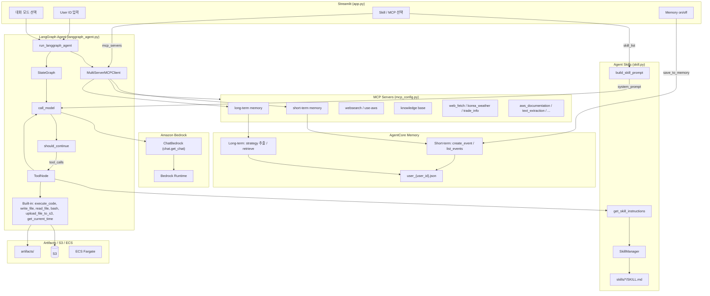

# ECS에서 LangGraph로 Agent 활용하기 

Agent는 MCP뿐 아니라 [Skill](https://github.com/anthropics/skills)을 활용하여 다양한 기능을 편리하게 구현할 수 있으며, [LangGraph](https://www.langchain.com/langgraph)로 구현한 Agent를 ECS Fargate에 배포하여 활용합니다. CloudFront → ALB → ECS Fargate로 Streamlit을 제공하고, User ID별로 대화·메모리를 분리합니다.

전체 인프라는 [installer.py](./installer.py)로 자동 배포합니다. Agent는 MCP와 skill을 함께 활용하여 RAG, 웹 검색, 문서 처리 등 다양한 작업을 수행할 수 있습니다.


## Memory

Chatbot은 연속적인 사용자의 대화를 이용하여 사용자의 경험을 향상시킬 수 있습니다. 일반 대화형 chatbot에서는 이전 대화를 [sliding window](https://langchain-ai.github.io/langgraph/concepts/memory/) 형태로 context에 포함하므로 사용할 수 있는 대화의 숫자가 제한되고, 이전 대화가 필요하지 않는 경우에도 context를 사용하는 문제가 있습니다. 여기에서는 short/long term memory를 지원하는 MCP와 AgentCore Memory를 이용하여 생성형 AI 애플리케이션이 필요할 때마다 메모리를 조회·저장하는 방법을 설명합니다.

[AgentCore Memory](https://docs.aws.amazon.com/bedrock-agentcore/latest/devguide/memory-getting-started.html)를 이용하면 별도의 DB를 만들어서 관리하지 않아도 short/long term memory를 손쉽게 활용할 수 있습니다. 대화 중 발생하는 transaction은 short-term memory에 저장되며, 주로 최근 n개의 메시지를 가져오는 방식으로 활용됩니다. 대화 중 중요한 정보는 long-term memory에 namespace를 이용해 저장됩니다. Long-term memory는 prompt를 가진 strategy를 이용해 사용자의 메시지로부터 필요한 정보를 자동으로 추출합니다.

### Short Term Memory

Short term memory를 위해서는 대화 transaction을 아래와 같이 AgentCore Memory에 저장합니다. 상세한 코드는 [agentcore_memory.py](./application/agentcore_memory.py)을 참조합니다.

```python
def save_conversation_to_memory(memory_id, actor_id, session_id, query, result):
    event_timestamp = datetime.now(timezone.utc)
    conversation = [
        (query, "USER"),
        (result, "ASSISTANT")
    ]
    memory_result = memory_client.create_event(
        memory_id=memory_id,
        actor_id=actor_id,
        session_id=session_id,
        event_timestamp=event_timestamp,
        messages=conversation
    )
```

이후, 대화 중에 사용자의 이전 대화 정보가 필요하다면 [mcp_server_short_term_memory.py](./application/mcp_server_short_term_memory.py)와 같이 memory, actor, session로 `max_results` 만큼의 이전 대화를 조회하여 활용합니다.

```python
events = client.list_events(
    memory_id=memory_id,
    actor_id=actor_id,
    session_id=session_id,
    max_results=max_results
)
```

### Long Term Memory

Long term memory를 위해 필요한 정보에는 memory, actor, session, namespace가 있습니다. 아래와 같이 이미 저장된 값이 있다면 가져오고, 없다면 생성합니다. 상세한 코드는 [chat.py](./application/chat.py)의 `initiate_memory()`를 참조합니다.

```python
# initiate memory variables
memory_id, actor_id, session_id, namespace = agentcore_memory.load_memory_variables(chat.user_id)
logger.info(f"memory_id: {memory_id}, actor_id: {actor_id}, session_id: {session_id}, namespace: {namespace}")

if memory_id is None:
    memory_id = agentcore_memory.retrieve_memory_id()
    if memory_id is None:
        memory_id = agentcore_memory.create_memory(namespace, chat.user_id)

    agentcore_memory.create_strategy_if_not_exists(
        memory_id=memory_id, namespace=namespace, strategy_name=chat.user_id
    )
    agentcore_memory.update_memory_variables(
        user_id=chat.user_id,
        memory_id=memory_id,
        actor_id=actor_id,
        session_id=session_id,
        namespace=namespace,
    )
```

생성형 AI 애플리케이션에서는 대화 중 필요한 메모리 정보가 있다면 MCP를 이용해 조회합니다. [mcp_server_long_term_memory.py](./application/mcp_server_long_term_memory.py)에서는 long term memory를 이용해 대화 이벤트를 저장하거나 조회할 수 있습니다.

```python
response = retrieve_memory_records(
    memory_id=memory_id,
    namespace=namespace,
    search_query=query,
    max_results=max_results,
    next_token=next_token,
)
```

"내가 다니는 회사에 대해 소개해줘"라고 질문하면 long term memory에서 사용자에 대한 정보를 가져와 답변할 수 있습니다.


## 사전 설치 (Prerequisites)

```bash
pip install bedrock-agentcore
python installer.py --project-name langgraph-ecs-project --region us-west-2
```

`installer.py`가 수행하는 작업 (Memory 관련):

1. AgentCore Memory용 IAM Role 생성 (`role-agentcore-memory-for-{project_name}-{region}`)
2. AgentCore Memory 인스턴스 생성 (기존 memory가 있으면 재사용)
3. `application/config.json`에 `agentcore_memory_role`, `memory_id` 저장
4. VPC, ALB, ECS Fargate, Knowledge Base, AgentCore Web Search Gateway 등 인프라 배포

## Memory 초기화 흐름

앱 실행 시 [app.py](./application/app.py)에서 User ID를 입력받고, `chat.set_user_id()`로 `mcp.env`에 저장합니다. Agent 모드에서 **Memory** 체크박스가 켜져 있으면 응답 후 `save_to_memory()`가 호출됩니다.

```
앱 시작
  └─ User ID 입력 (st.session_state.user_id)
       └─ chat.set_user_id() → mcp.env {"user_id": "..."} 저장

Agent (Chat) 응답 완료 + Memory Enable
  └─ save_to_memory(prompt, response)
       └─ memory_id가 None이면 → initiate_memory()
            ├─ agentcore_memory.load_memory_variables(user_id)
            │    ├─ user_{user_id}.json 에서 기존 변수 로드
            │    ├─ config.json의 memory_id 또는 retrieve_memory_id()로 조회
            │    └─ 여전히 없으면 → create_memory()로 신규 생성
            ├─ create_strategy_if_not_exists()로 strategy 확인/생성
            └─ update_memory_variables()로 user_{user_id}.json에 저장
       └─ agentcore_memory.save_conversation_to_memory()
```

## 주요 변수

### config.json (프로젝트 설정)

| 변수 | 설명 |
|------|------|
| `projectName` | 프로젝트 이름. memory name으로도 사용 (`-` → `_` 치환) |
| `region` | AWS 리전 |
| `accountId` | AWS 계정 ID |
| `agentcore_memory_role` | Memory 실행용 IAM Role ARN |
| `memory_id` | installer가 생성한 AgentCore Memory 인스턴스 ID |

### user_{user_id}.json (사용자별 설정)

| 변수 | 설명 |
|------|------|
| `memory_id` | AgentCore Memory 인스턴스 ID |
| `actor_id` | 사용자 식별자 (기본값: `user_id`) |
| `session_id` | 세션 ID (기본값: `uuid4().hex`로 자동 생성) |
| `namespace` | memory namespace (기본값: `/users/{actor_id}`) |

### mcp.env (MCP 서버용)

| 변수 | 설명 |
|------|------|
| `user_id` | short/long term memory MCP가 사용자를 식별하는 ID |

```json
{"user_id": "user01"}
```

### app.py / chat.py 변수

| 변수 | 설명 |
|------|------|
| `user_id` | Streamlit에서 입력받은 사용자 ID (`chat.user_id`) |
| `enable_memory` | Memory 체크박스 상태 (`Enable` / `Disable`) |
| `memoryMode` | app.py 사이드바 Memory on/off |

## 대화 저장 방법

[app.py](./application/app.py)에서 Agent / Agent (Chat) 모드 응답 후 Memory가 켜져 있으면 `save_to_memory()`를 호출합니다.

```python
if memoryMode == "Enable":
    chat.save_to_memory(prompt, response)
```

`save_to_memory()`는 내부적으로 아래를 호출합니다.

```python
agentcore_memory.save_conversation_to_memory(memory_id, actor_id, session_id, query, result)
```

저장 과정:

1. `query`(사용자 입력)와 `result`(어시스턴트 응답)의 유효성 검사
2. AWS Bedrock 제한에 맞게 9,000자 초과 시 truncate
3. `(query, "USER")`, `(result, "ASSISTANT")` 형태의 conversation으로 변환
4. `memory_client.create_event()`로 memory에 이벤트 저장

### Memory Strategy

memory 생성 시 `customMemoryStrategy`가 함께 설정됩니다:

- **모델**: `us.anthropic.claude-haiku-4-5-20251001-v1:0`
- **역할**: 대화에서 사용자의 명시적/암시적 선호도를 추출 (한국어)
- **만료**: 이벤트 365일 후 만료


## MCP를 이용한 메모리 활용

MCP(Model Context Protocol) 서버를 통해 에이전트가 단기/장기 메모리에 접근할 수 있습니다. [mcp_config.py](./application/mcp_config.py)에서 `short term memory`, `long term memory`를 선택하면 stdio MCP 서버가 연결됩니다.

### 단기 메모리 (Short-Term Memory)

**파일**: [mcp_server_short_term_memory.py](./application/mcp_server_short_term_memory.py)

| 도구 | 파라미터 | 설명 |
|------|---------|------|
| `list_events` | `max_results` (기본값: 10) | 현재 세션의 최근 대화 이벤트 목록 조회 |

**동작 방식**:

1. `mcp.env`에서 `user_id`를 읽어옴
2. `agentcore_memory.load_memory_variables()`로 `memory_id`, `actor_id`, `session_id` 로드
3. `MemoryClient.list_events()`로 최근 대화 이벤트 반환

### 장기 메모리 (Long-Term Memory)

**파일**: [mcp_server_long_term_memory.py](./application/mcp_server_long_term_memory.py) → [mcp_long_term_memory.py](./application/mcp_long_term_memory.py)

| 도구 | 설명 |
|------|------|
| `long_term_memory` | 장기 메모리에 대한 CRUD 및 시맨틱 검색 |

**`long_term_memory` action**:

| action | 설명 | API |
|--------|------|-----|
| `record` | 텍스트를 memory에 이벤트로 저장 | `create_event()` |
| `retrieve` | 시맨틱 검색으로 관련 memory record 조회 | `retrieve_memory_records()` |
| `list` | 전체 memory record 목록 조회 | `list_memory_records()` |
| `get` | 특정 memory record를 ID로 조회 | `get_memory_record()` |
| `delete` | 특정 memory record 삭제 | `delete_memory_record()` |

### 단기 vs 장기 메모리 비교

| 구분 | 단기 메모리 | 장기 메모리 |
|------|-----------|-----------|
| 데이터 | 원본 대화 이벤트 (USER/ASSISTANT) | strategy가 추출한 구조화된 기억 |
| 범위 | 현재 세션의 최근 대화 | 세션/시간에 걸친 축적된 지식 |
| 검색 | 시간순 목록 조회 | 시맨틱 검색 지원 |
| 용도 | 최근 맥락 참조 | 사용자 선호도, 패턴 등 장기 기억 활용 |


## Operation Architecture



| 모드 | 모듈 | 설명 |
|------|------|------|
| 일상적인 대화 | `chat.general_conversation` | 대화 이력 + ChatBedrock 스트리밍 |
| RAG | `chat.run_rag_with_knowledge_base` | Bedrock Knowledge Base 검색(`retrieve`) 후 ChatBedrock으로 답변 생성 |
| **Agent** | `langgraph_agent.run_langgraph_agent` | LangGraph StateGraph + built-in tools + MCP + Skills (단일 턴) |
| **Agent (Chat)** | `langgraph_agent.run_langgraph_agent` | Agent와 동일 + LangGraph checkpointer로 대화 이력 유지 (`thread_id` = `user_id`) |
| 번역하기 | `chat.translate_text` | 한국어 ↔ 영어 번역 |
| 이미지 분석 | `chat.summarize_image` | ChatBedrock 멀티모달 (이미지 + 텍스트) 분석 |

### Message Trim

LangGraph 에이전트([application/langgraph_agent.py](./application/langgraph_agent.py)의 `call_model`)는 LLM 호출 직전에 **HumanMessage 기준 최근 N턴**만 남깁니다. LangGraph state의 `messages`는 checkpointer에 그대로 두고, **모델에 넘기는 메시지만** trim합니다. `history_mode=Enable`/`Disable` 모두 동일하게 적용됩니다.

**기본값:** `MAX_CONTEXT_TURNS = 5` (일반 채팅의 `SimpleMemory(k=5)`와 동일한 “최근 5턴” 의도)

**설정 변경:**

- [application/langgraph_agent.py](./application/langgraph_agent.py)의 `MAX_CONTEXT_TURNS` 상수 수정
- 또는 `create_agent()`에서 생성하는 config의 `max_turns` / `configurable.max_turns` 지정
- `max_turns=0`이면 trim 비활성화

상수와 trim 함수는 `langgraph_agent.py`에 정의합니다.

```python
# application/langgraph_agent.py
MAX_CONTEXT_TURNS = 5


def trim_messages_by_human_turns(messages: list, max_turns: int) -> list:
    """Keep messages from the last N HumanMessage turns (inclusive)."""
    if max_turns <= 0 or not messages:
        return messages

    human_indices = [i for i, msg in enumerate(messages) if isinstance(msg, HumanMessage)]
    if len(human_indices) <= max_turns:
        return messages

    return messages[human_indices[-max_turns]:]
```

`call_model`에서는 `ToolMessage` content 정규화 후 trim을 적용합니다.

```python
# application/langgraph_agent.py — call_model() 내부
        max_turns = (
            config.get("configurable", {}).get("max_turns")
            or config.get("max_turns")
            or MAX_CONTEXT_TURNS
        )
        trimmed = trim_messages_by_human_turns(messages, max_turns)
        if len(trimmed) < len(messages):
            logger.info(
                f"trimmed messages from {len(messages)} to {len(trimmed)} "
                f"(max_turns={max_turns})"
            )
            messages = trimmed

        prompt = ChatPromptTemplate.from_messages([
            ("system", system),
            MessagesPlaceholder(variable_name="messages"),
        ])
        chain = prompt | model
        async for chunk in chain.astream({"messages": messages}):
            ...
```

에이전트 config는 `create_agent()`에서 생성하며, `history_mode`와 관계없이 `max_turns`를 전달합니다.

```python
# application/langgraph_agent.py — create_agent()
    if history_mode == "Enable":
        app = buildChatAgentWithHistory(tools)
        config = {
            "recursion_limit": 500,
            "configurable": {"thread_id": chat.user_id},
            "tools": tools,
            "system_prompt": system_prompt,
            "max_turns": MAX_CONTEXT_TURNS,
        }
    else:
        app = buildChatAgent(tools)
        config = {
            "recursion_limit": 500,
            "configurable": {"thread_id": chat.user_id},
            "tools": tools,
            "system_prompt": system_prompt,
            "max_turns": MAX_CONTEXT_TURNS,
        }
```

**`max_turns=5`의 의미**

- **사용자 HumanMessage 5개**와, 각 턴에 이어진 **모든 후속 메시지**를 유지
- 1턴 = `HumanMessage` 1개 + 그 뒤의 `AIMessage`, `ToolMessage`, 도구 feedback loop 전체
- 도구를 여러 번 호출해도 **같은 사용자 질문이면 1턴**으로 카운트

**예 (도구 사용 포함)**

```
Human(Q1) → AI(tool_calls) → ToolMessage → AI(A1)
Human(Q2) → AI(A2)
Human(Q3) → AI(tool_calls) → ToolMessage → AI(A3)
```

`max_turns=2`이면 **Q2부터** 유지:

```
Human(Q2) → AI(A2) → Human(Q3) → AI(tool_calls) → ToolMessage → AI(A3)
```

**메시지 개수 trim과의 차이**

| 방식 | `N=5`일 때 |
|------|------------|
| 이전 (메시지 개수) | 메시지 객체 5개만 유지 → 도구 루프 때문에 사용자 턴 수가 불규칙 |
| 현재 (HumanMessage 턴) | 사용자 질문 5개 + 각 턴의 AI/Tool 응답 전체 유지 |

**Checkpointer와의 관계**

- `history_mode=Enable`일 때 `MemorySaver` checkpointer에는 **전체 대화 이력**이 저장됩니다.
- trim은 LLM 컨텍스트 윈도우 관리용이며, 저장된 history를 삭제하지 않습니다.
- CloudWatch(`/ecs/...`) 또는 애플리케이션 로그에서 `trimmed messages from X to Y (max_turns=5)`로 trim 여부를 확인할 수 있습니다.

## 배포하기

### installer.py로 배포하기

저장소를 클론한 후 `installer.py`로 전체 인프라(AgentCore Memory, Knowledge Base, VPC, ALB, ECS Fargate, CloudFront)를 배포합니다.

```bash
git clone https://github.com/kyopark2014/langgraph-ecs-project
cd langgraph-ecs-project
pip install -r requirements.txt
python installer.py
```

API 구현에 필요한 credential은 secret으로 관리합니다. 설치 시 필요한 credential 예시:

- 일반 인터넷 검색: [Tavily Search](https://app.tavily.com/sign-in) API Key (`tvly-`로 시작)
- 날씨 검색: [openweathermap](https://home.openweathermap.org/api_keys) API Key (Free plan)

설치가 완료되면 CloudFront URL로 접속하여 Agent를 실행합니다. 앱 시작 시 **User ID**를 입력하고, 사이드바에서 **Memory** 및 MCP(`short term memory`, `long term memory`)를 선택합니다.

인프라가 더 이상 필요 없을 때에는 [uninstaller.py](./uninstaller.py)를 이용해 제거합니다.

```bash
python uninstaller.py
```

상세한 installer 동작은 [installer.md](./installer.md)를 참조하세요.


### Local에서 실행하기

AWS 환경을 잘 활용하기 위해서는 [AWS CLI를 설치](https://docs.aws.amazon.com/ko_kr/cli/v1/userguide/cli-chap-install.html)하여야 합니다. Local에 설치시는 아래 명령어를 참조합니다.

```text
curl "https://awscli.amazonaws.com/awscli-exe-linux-x86_64.zip" -o "awscliv2.zip"
unzip awscliv2.zip
sudo ./aws/install
```

AWS credential을 아래와 같이 AWS CLI를 이용해 등록합니다.

```text
aws configure
```

venv로 환경을 구성하면 편리하게 패키지를 관리합니다.

```text
python -m venv .venv
source .venv/bin/activate
```

이후 다운로드 받은 github 폴더로 이동한 후에 아래와 같이 필요한 패키지를 추가로 설치 합니다.

```text
pip install -r requirements.txt
```

installer로 AgentCore Memory와 Knowledge Base를 먼저 프로비저닝한 뒤, 아래와 같이 streamlit을 실행합니다.

```text
streamlit run application/app.py
```

앱 시작 시 User ID를 입력하고, Agent (Chat) 모드에서 Memory를 켠 상태로 대화하면 AgentCore Memory에 저장됩니다.


### MCP

Plugin의 Connector는 MCP를 이용해 구현합니다. Memory 관련 MCP는 아래와 같습니다.

- **short term memory**: [mcp_server_short_term_memory.py](./application/mcp_server_short_term_memory.py) — 최근 대화 이벤트 조회 (`list_events`)
- **long term memory**: [mcp_server_long_term_memory.py](./application/mcp_server_long_term_memory.py) — 시맨틱 검색·CRUD (`long_term_memory`)

기타 MCP 설정은 아래를 참조합니다.

- [Slack](https://github.com/kyopark2014/mcp/blob/main/mcp-slack.md): Slack 내용을 조회하고 메시지를 보낼 수 있습니다. SLACK_TEAM_ID, SLACK_BOT_TOKEN으로 설정합니다.

- [Tavily](https://github.com/kyopark2014/mcp/blob/main/mcp-tavily.md): Tavily를 이용해 인터넷을 검색합니다. [installer.py](./installer.py)에서 secret으로 설정후에 [utils.py](./application/utils.py)에서 TAVILY_API_KEY로 등록하여 활용합니다.

- [RAG](https://github.com/kyopark2014/mcp/blob/main/mcp-rag.md): Knowledge Base를 이용해 RAG를 활용합니다. IAM 인증을 이용하므로 별도로 credential 설정하지 않습니다.

- [web_fetch](https://github.com/kyopark2014/mcp/blob/main/mcp-web-fetch.md): playwright기반으로 url의 문서를 markdown으로 불러올 수 있습니다. 별도 인증이 필요하지 않습니다.

- [Google 메일/캘린더](https://github.com/kyopark2014/mcp/blob/main/mcp-gog.md): 구글 메일을 조회하거나 보낼 수 있습니다. Gog CLI를 설치하여 google 인증을 통해 활용합니다.

- [Notion](https://github.com/kyopark2014/mcp/blob/main/mcp-notion.md): Notion을 읽거나 쓸 수 있습니다. [installer.py](./installer.py)에서 secret으로 설정후에 [utils.py](./application/utils.py)에서 NOTION_TOKEN을 등록하여 활용합니다.

- [text_extraction](https://github.com/kyopark2014/mcp/blob/main/mcp-text-extraction.md): 이미지의 텍스트를 추출합니다. 별도 인증이 필요하지 않습니다.


## 실행 결과


## Reference

[Amazon Bedrock AgentCore Memory](https://docs.aws.amazon.com/bedrock-agentcore/latest/devguide/memory-getting-started.html)

[agentcore-memory (참조 프로젝트)](https://github.com/kyopark2014/agent-memory)

[anthropics / skills](https://github.com/anthropics/skills)

[Agent Skills](https://agentskills.io/home)

[Notion Skills for Claude](https://www.notion.so/notiondevs/Notion-Skills-for-Claude-28da4445d27180c7af1df7d8615723d0)

[Claude Code Skills](https://support.claude.com/en/articles/12512176-what-are-skills)

[example skills](https://github.com/anthropics/skills)

[Agent Skills for Strands Agents SDK](https://github.com/aws-samples/sample-strands-agents-agentskills)

[Claude Code Plugins: Orchestration and Automation](https://github.com/wshobson/agents/tree/main)

[Deep Agents CLI](https://github.com/langchain-ai/deepagents/tree/master/libs/cli)

[Using skills with Deep Agents CLI](https://www.youtube.com/watch?v=Yl_mdp2IiW4)

[Open Agent Skills](https://skills.sh/)
